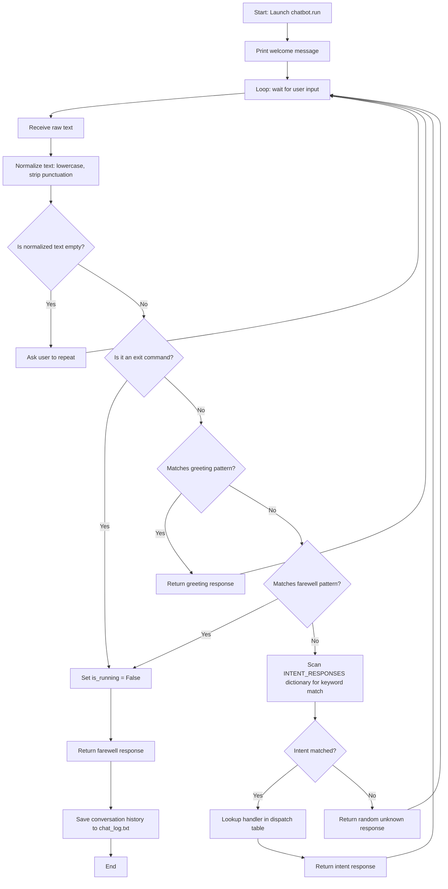
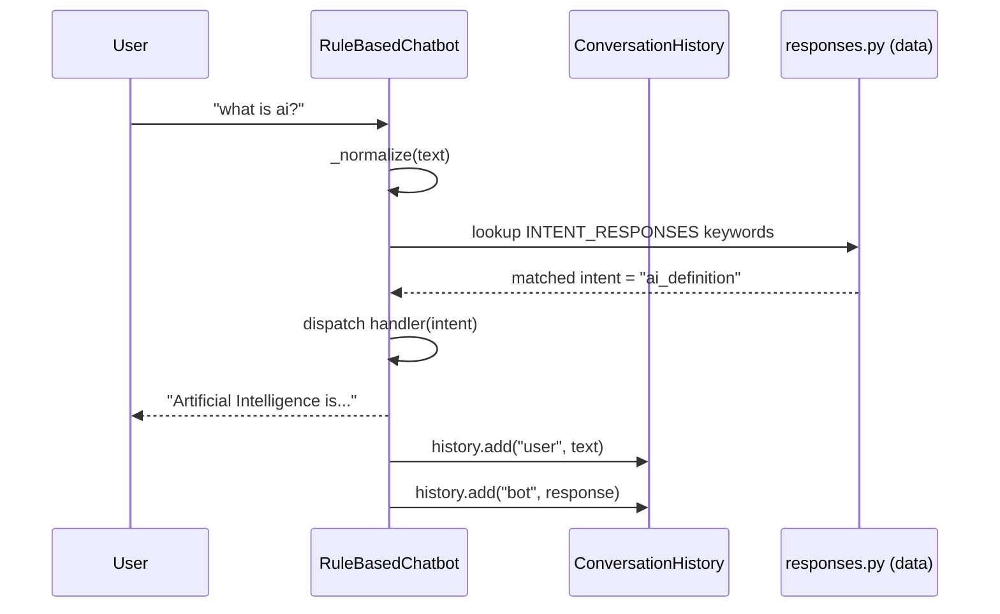

# Flowchart — Rule-Based AI Chatbot

## Mermaid Flowchart

```mermaid
flowchart TD
    A[Start: Launch chatbot.run] --> B[Print welcome message]
    B --> C[Loop: wait for user input]
    C --> D[Receive raw text]
    D --> E[Normalize text: lowercase, strip punctuation]
    E --> F{Is normalized text empty?}
    F -- Yes --> G[Ask user to repeat] --> C
    F -- No --> H{Is it an exit command?}
    H -- Yes --> I[Set is_running = False] --> J[Return farewell response]
    H -- No --> K{Matches greeting pattern?}
    K -- Yes --> L[Return greeting response] --> C
    K -- No --> M{Matches farewell pattern?}
    M -- Yes --> I
    M -- No --> N[Scan INTENT_RESPONSES dictionary for keyword match]
    N --> O{Intent matched?}
    O -- Yes --> P[Lookup handler in dispatch table] --> Q[Return intent response] --> C
    O -- No --> R[Return random unknown response] --> C
    J --> S[Save conversation history to chat_log.txt]
    S --> T[End]
```

## Sequence Diagram — One Conversational Turn

```mermaid
sequenceDiagram
    participant U as User
    participant B as RuleBasedChatbot
    participant H as ConversationHistory
    participant R as responses.py (data)

    U->>B: "what is ai?"
    B->>B: _normalize(text)
    B->>R: lookup INTENT_RESPONSES keywords
    R-->>B: matched intent = "ai_definition"
    B->>B: dispatch handler(intent)
    B-->>U: "Artificial Intelligence is..."
    B->>H: history.add("user", text)
    B->>H: history.add("bot", response)
```
